# Tim's Fantasy World - 系統架構流程圖

## 完整系統架構與檔案連結關係

```mermaid
graph TD
    %% 使用者入口
    USER[使用者] --> HOMEPAGE[首頁 /]
    
    %% 首頁架構
    HOMEPAGE --> HOMEPAGE_FILE["frontend/src/app/[countryCode]/(main)/page.tsx"]
    HOMEPAGE_FILE --> LAYOUT_MAIN["frontend/src/app/[countryCode]/(main)/layout.tsx"]
    HOMEPAGE_FILE --> ROOT_LAYOUT["frontend/src/app/layout.tsx"]
    
    %% 導覽系統
    ROOT_LAYOUT --> NAV_COMPONENT["frontend/src/modules/layout/templates/nav/index.tsx"]
    NAV_COMPONENT --> MOBILE_MENU["frontend/src/modules/layout/components/mobile-menu.tsx"]
    NAV_COMPONENT --> CART_BUTTON["frontend/src/modules/layout/components/cart-button.tsx"]
    NAV_COMPONENT --> ACCOUNT_BUTTON["frontend/src/modules/layout/components/account-button.tsx"]
    NAV_COMPONENT --> COUNTRY_SELECT["frontend/src/modules/layout/components/country-select.tsx"]
    NAV_COMPONENT --> SEARCH_BAR["frontend/src/modules/layout/components/search-bar-client.tsx"]
    
    %% 資料層
    NAV_COMPONENT --> REGIONS_DATA["frontend/src/lib/data/regions.ts"]
    NAV_COMPONENT --> COLLECTIONS_DATA["frontend/src/lib/data/collections.ts"]
    NAV_COMPONENT --> CATEGORIES_DATA["frontend/src/lib/data/categories.ts"]
    NAV_COMPONENT --> SANITY_API["frontend/src/lib/sanity.ts"]
    
    %% 首頁組件
    HOMEPAGE_FILE --> HERO_SECTION["frontend/src/modules/home/components/hero-section/index.tsx"]
    HOMEPAGE_FILE --> FEATURED_PRODUCTS["frontend/src/modules/home/components/featured-products/index.tsx"]
    HOMEPAGE_FILE --> BLOG_POSTS["frontend/src/modules/blog/components/blog-posts/index.tsx"]
    HOMEPAGE_FILE --> IMAGE_TEXT_BLOCK["frontend/src/modules/home/components/image-text-block/index.tsx"]
    HOMEPAGE_FILE --> YOUTUBE_SECTION["frontend/src/modules/home/components/youtube-section/index.tsx"]
    HOMEPAGE_FILE --> SERVICE_CARDS_SECTION["frontend/src/modules/home/components/service-cards-section/index.tsx"]
    HOMEPAGE_FILE --> CONTENT_SECTION["frontend/src/modules/home/components/content-section/index.tsx"]
    
    %% 主要路由
    USER --> PRODUCTS_ROUTE["/products/[handle]"]
    PRODUCTS_ROUTE --> PRODUCT_PAGE["frontend/src/app/[countryCode]/(main)/products/[handle]/page.tsx"]
    PRODUCT_PAGE --> PRODUCT_TEMPLATE["frontend/src/modules/products/templates/index.tsx"]
    PRODUCT_PAGE --> PRODUCTS_DATA["frontend/src/lib/data/products.ts"]
    
    USER --> CART_ROUTE["/cart"]
    CART_ROUTE --> CART_PAGE["frontend/src/app/[countryCode]/(main)/cart/page.tsx"]
    CART_PAGE --> CART_TEMPLATE["frontend/src/modules/cart/templates/index.tsx"]
    CART_PAGE --> CART_DATA["frontend/src/lib/data/cart.ts"]
    
    USER --> ACCOUNT_ROUTE["/account"]
    ACCOUNT_ROUTE --> ACCOUNT_LAYOUT["frontend/src/app/[countryCode]/(main)/account/layout.tsx"]
    ACCOUNT_ROUTE --> ACCOUNT_DASHBOARD["frontend/src/app/[countryCode]/(main)/account/@dashboard/page.tsx"]
    ACCOUNT_DASHBOARD --> ACCOUNT_OVERVIEW["frontend/src/modules/account/components/overview/index.tsx"]
    ACCOUNT_DASHBOARD --> CUSTOMER_DATA["frontend/src/lib/data/customer.ts"]
    ACCOUNT_DASHBOARD --> ORDERS_DATA["frontend/src/lib/data/orders.ts"]
    
    %% 聯盟系統前端
    USER --> AFFILIATE_ROUTE["/affiliate"]
    AFFILIATE_ROUTE --> AFFILIATE_PAGE["frontend/src/app/[countryCode]/(main)/affiliate/page.tsx"]
    AFFILIATE_PAGE --> AFFILIATE_CLIENT["frontend/src/app/[countryCode]/(main)/affiliate/affiliate-page-client.tsx"]
    AFFILIATE_CLIENT --> AFFILIATE_API_CLIENT["frontend/src/lib/affiliate-api.ts"]
    
    %% 後端API架構
    FRONTEND_APIS["前端 API 調用"] --> BACKEND_API_ROOT["backend/src/api/"]
    
    %% 商店API
    BACKEND_API_ROOT --> STORE_API["backend/src/api/store/"]
    STORE_API --> STORE_AFFILIATE_API["backend/src/api/store/affiliate/"]
    STORE_AFFILIATE_API --> AFFILIATE_LOGIN["backend/src/api/store/affiliate/login/route.ts"]
    STORE_AFFILIATE_API --> AFFILIATE_REGISTER["backend/src/api/store/affiliate/register/route.ts"]
    
    %% 管理API
    BACKEND_API_ROOT --> ADMIN_API["backend/src/api/admin/"]
    BACKEND_API_ROOT --> ADMIN_AFFILIATES["backend/src/api/admin-affiliates/route.ts"]
    
    %% 服務層
    AFFILIATE_LOGIN --> AFFILIATE_SERVICE["backend/src/services/affiliate.ts"]
    AFFILIATE_REGISTER --> AFFILIATE_SERVICE
    ADMIN_AFFILIATES --> AFFILIATE_SERVICE
    
    %% 資料庫連接
    AFFILIATE_SERVICE --> DATABASE[("PostgreSQL 資料庫")]
    DATABASE --> AFFILIATE_PARTNER_TABLE[("affiliate_partner")]
    DATABASE --> AFFILIATE_CLICK_TABLE[("affiliate_click")]
    DATABASE --> AFFILIATE_CONVERSION_TABLE[("affiliate_conversion")]
    
    %% 內容管理
    SANITY_API --> SANITY_CMS[("Sanity CMS")]
    SANITY_CMS --> HOMEPAGE_DATA[("首頁內容")]
    SANITY_CMS --> HEADER_DATA[("導覽資料")]
    SANITY_CMS --> FOOTER_DATA[("頁尾資料")]
    
    %% 其他頁面
    USER --> CATEGORIES_ROUTE["/categories/[handle]"]
    USER --> COLLECTIONS_ROUTE["/collections/[handle]"]
    USER --> SEARCH_ROUTE["/search"]
    USER --> CHECKOUT_ROUTE["/checkout"]
    
    %% 分類與收藏頁面
    CATEGORIES_ROUTE --> CATEGORIES_PAGE["frontend/src/app/[countryCode]/(main)/categories/[handle]/page.tsx"]
    COLLECTIONS_ROUTE --> COLLECTIONS_PAGE["frontend/src/app/[countryCode]/(main)/collections/[handle]/page.tsx"]
    
    %% 搜尋頁面
    SEARCH_ROUTE --> SEARCH_PAGE["frontend/src/app/[countryCode]/(main)/search/page.tsx"]
    SEARCH_PAGE --> SEARCH_TEMPLATE["frontend/src/modules/search/templates/index.tsx"]
    
    %% 結帳流程
    CHECKOUT_ROUTE --> CHECKOUT_PAGE["frontend/src/app/[countryCode]/(checkout)/page.tsx"]
    CHECKOUT_PAGE --> CHECKOUT_TEMPLATE["frontend/src/modules/checkout/templates/index.tsx"]
    CHECKOUT_PAGE --> PAYMENT_DATA["frontend/src/lib/data/payment.ts"]
    
    %% 中間件
    ROOT_LAYOUT --> MIDDLEWARE["frontend/src/middleware.ts"]
    
    %% 樣式
    ROOT_LAYOUT --> GLOBAL_CSS["frontend/src/styles/globals.css"]
    ROOT_LAYOUT --> TAILWIND_CONFIG["frontend/tailwind.config.js"]
    
    %% 配置檔案
    HOMEPAGE_FILE --> NEXT_CONFIG["frontend/next.config.js"]
    BACKEND_API_ROOT --> MEDUSA_CONFIG["backend/medusa-config.ts"]
    
    %% 型別定義
    HOMEPAGE_FILE --> PAGE_SECTIONS_TYPES["frontend/src/lib/types/page-sections.ts"]
    AFFILIATE_CLIENT --> GLOBAL_TYPES["frontend/src/types/global.ts"]
    
    %% 公共組件
    PRODUCT_TEMPLATE --> COMMON_COMPONENTS["frontend/src/modules/common/"]
    CART_TEMPLATE --> COMMON_COMPONENTS
    ACCOUNT_OVERVIEW --> COMMON_COMPONENTS
    
    %% 骨架屏組件
    FEATURED_PRODUCTS --> SKELETON_COMPONENTS["frontend/src/modules/skeletons/"]
    
    %% 提供者
    ROOT_LAYOUT --> PROVIDERS["frontend/src/providers/"]
    PROVIDERS --> TOAST_PROVIDER["frontend/src/providers/toast-provider.tsx"]
    
    %% 樣式類別
    classDef frontend fill:#e1f5fe,stroke:#01579b,stroke-width:2px,color:#000
    classDef backend fill:#fff3e0,stroke:#e65100,stroke-width:2px,color:#000
    classDef database fill:#f3e5f5,stroke:#4a148c,stroke-width:2px,color:#000
    classDef cms fill:#e8f5e8,stroke:#1b5e20,stroke-width:2px,color:#000
    classDef config fill:#fff8e1,stroke:#f57f17,stroke-width:2px,color:#000
    
    %% 應用樣式
    class HOMEPAGE_FILE,LAYOUT_MAIN,ROOT_LAYOUT,NAV_COMPONENT,MOBILE_MENU,CART_BUTTON,ACCOUNT_BUTTON,COUNTRY_SELECT,SEARCH_BAR frontend
    class REGIONS_DATA,COLLECTIONS_DATA,CATEGORIES_DATA,PRODUCTS_DATA,CART_DATA,CUSTOMER_DATA,ORDERS_DATA frontend
    class HERO_SECTION,FEATURED_PRODUCTS,BLOG_POSTS,IMAGE_TEXT_BLOCK,YOUTUBE_SECTION,SERVICE_CARDS_SECTION,CONTENT_SECTION frontend
    class PRODUCT_PAGE,CART_PAGE,ACCOUNT_DASHBOARD,AFFILIATE_PAGE,CATEGORIES_PAGE,COLLECTIONS_PAGE,SEARCH_PAGE,CHECKOUT_PAGE frontend
    class PRODUCT_TEMPLATE,CART_TEMPLATE,ACCOUNT_OVERVIEW,AFFILIATE_CLIENT,SEARCH_TEMPLATE,CHECKOUT_TEMPLATE frontend
    class COMMON_COMPONENTS,SKELETON_COMPONENTS,PROVIDERS,TOAST_PROVIDER frontend
    class AFFILIATE_API_CLIENT,SANITY_API,PAYMENT_DATA frontend
    
    class BACKEND_API_ROOT,STORE_API,ADMIN_API,STORE_AFFILIATE_API,ADMIN_AFFILIATES backend
    class AFFILIATE_LOGIN,AFFILIATE_REGISTER,AFFILIATE_SERVICE backend
    
    class DATABASE,AFFILIATE_PARTNER_TABLE,AFFILIATE_CLICK_TABLE,AFFILIATE_CONVERSION_TABLE database
    
    class SANITY_CMS,HOMEPAGE_DATA,HEADER_DATA,FOOTER_DATA cms
    
    class MIDDLEWARE,GLOBAL_CSS,TAILWIND_CONFIG,NEXT_CONFIG,MEDUSA_CONFIG config
    class PAGE_SECTIONS_TYPES,GLOBAL_TYPES config
```

## 主要檔案說明

### 前端架構
- **根布局**: `/frontend/src/app/layout.tsx` - 全域設定、字體、metadata
- **主頁面**: `/frontend/src/app/[countryCode]/(main)/page.tsx` - 首頁內容渲染
- **導覽系統**: `/frontend/src/modules/layout/templates/nav/index.tsx` - 頁首導覽
- **資料層**: `/frontend/src/lib/data/` - 各種資料獲取函數

### 後端API架構  
- **商店API**: `/backend/src/api/store/` - 前端使用的API
- **管理API**: `/backend/src/api/admin/` - 後台管理API
- **聯盟系統**: `/backend/src/api/store/affiliate/` - 聯盟夥伴相關API
- **服務層**: `/backend/src/services/` - 業務邏輯處理

### 內容管理
- **Sanity CMS**: 管理首頁內容、導覽選單、頁尾等動態內容
- **類型定義**: `/frontend/src/lib/types/` - TypeScript 類型定義

### 主要頁面路由
- `/` - 首頁
- `/products/[handle]` - 產品詳情頁
- `/cart` - 購物車
- `/account` - 會員中心
- `/affiliate` - 聯盟夥伴系統
- `/categories/[handle]` - 商品分類
- `/collections/[handle]` - 商品系列
- `/search` - 搜尋結果
- `/checkout` - 結帳流程

這個流程圖展示了從使用者訪問首頁開始，整個系統的檔案連結關係和依賴結構，幫助您了解每個檔案的作用和相互關係。
